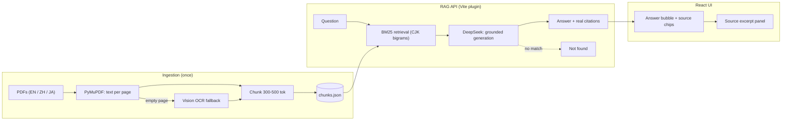

<div align="center">

# 🧭 Gainwise Sales Copilot

**A chat copilot that gives B2B sales reps instant, _cited_ answers to client
technical questions — grounded in manufacturer catalogs, in English, 中文 and 日本語.**

Every answer links back to the exact source page. No guessing: if the catalogs
don't cover it, it says so.

<br />


</div>

---

## Demo

▶️ **[Watch the 60-second walkthrough](./Gainwise_Sales_Copilot_Demo.mp4)** — asking
suggested questions (answered in ~2s), clicking through to cited source excerpts,
cross-language retrieval (中文 question → English catalog), the honest "not found"
state, the Sources explorer, privacy policy, and dark mode.

## What it is

Sales reps at a trading company get peppered with technical questions — MOQ,
certifications, torque ranges, IP ratings, clamping force — buried across dozens
of manufacturer PDFs in three languages. Gainwise answers them in seconds and
**shows its receipts**: every claim is backed by a clickable source chip
(`filename · p.12`) that opens the original excerpt.

The whole thing runs locally on one command. Retrieval is plain BM25 (no vector
DB), generation is DeepSeek, and the data layer is a single swappable module.

## Highlights

- 📎 **Citations are the product.** Each answer carries source chips; clicking one
  opens the real excerpt in a side panel — pulled from the retrieved chunk, never
  the model's paraphrase.
- 🌏 **Cross-language retrieval.** A Chinese question can pull an answer from an
  English or Japanese source (and reply in the asker's language). CJK text is
  tokenized by character bigrams so BM25 actually works on 中文 / 日本語.
- 🛑 **Honest "not found."** If the catalogs don't answer it, the copilot returns
  a calm amber "not in the indexed documents" state instead of hallucinating.
- 🧩 **Clean architecture.** The UI only talks to three functions
  (`listSources` / `ask` / `getSuggestedQuestions`). Phase 1 was pure mock;
  Phase 2 swapped in a real RAG backend **without touching a single component.**
- ⚡ **One-process dev.** The RAG API is mounted on the Vite dev server — no
  separate backend, proxy, or CORS. `npm run dev` runs everything.
- 🌓 **Enterprise-grade UI.** Light/dark themes, keyboard-navigable, WCAG-minded
  contrast, foldable knowledge-base sidebar, a downloadable **Sources** explorer,
  and a built-in privacy policy.
- 🔌 **Runs without a key too.** No `DEEPSEEK_API_KEY`? It degrades to an
  extractive mode that still shows real citations.

## Architecture



## Quick start

```bash
npm install
python3 -m pip install pymupdf          # ingestion dependency

# 1. add PDFs to data/catalogue_pdfs/  (vendor catalogs are NOT shipped)
npm run ingest                          # parse PDFs -> data/index/chunks.json

# 2. add your key
cp .env.example .env                    # then set DEEPSEEK_API_KEY

# 3. run everything (app + RAG API) on one port
npm run dev                             # http://localhost:5173
```

> **Bring your own PDFs.** The manufacturer catalogs used in development are
> third-party copyrighted material and are **not committed**. Drop any mix of
> EN / 中文 / 日本語 PDFs into `data/catalogue_pdfs/` and run `npm run ingest`.

### API key

Generation uses **DeepSeek** (OpenAI-compatible). Put your key in `.env`:

```
DEEPSEEK_API_KEY=sk-...
```

`.env` is git-ignored — keys are never committed. **Without a key**, `ask()`
falls back to an extractive mode that returns the most relevant indexed passage
with its real citation (and still shows "not found" for out-of-corpus queries).

## How it works

**1 · Ingestion — `scripts/ingest.py` (PyMuPDF).** Extracts text per page,
dedupes identical files by hash, chunks each page into ~300–500-token sections
with overlap, and writes `data/index/chunks.json`
(`{ id, text, filename, page, language }`). Scanned/image pages (empty text
layer) are rendered to PNG and transcribed by a vision model — the path is
implemented and triggers automatically when needed.

**2 · Retrieval — `server/bm25.ts` + `tokenize.ts`.** Dependency-free Okapi
BM25 over the chunks (small corpus → instant, no vector DB). English →
word tokens; **Chinese/Japanese → character bigrams**, all in one shared token
space, so a query in one language retrieves sources in another.

**3 · Generation — `server/generate.ts` (DeepSeek).** Sends the question +
retrieved chunks (with `filename`/`page` visible) under a strict grounding
prompt: answer only from the sources, reply in the question's language, and
return a **not-found** verdict rather than guess. Uses DeepSeek JSON mode for
structured output, then rebuilds citations from the **actual chunk text** so the
source panel always shows a true quote. Response time is measured, not faked.

### The swappable data layer

The React UI imports only these three functions from `src/mock/mockApi.ts`;
their signatures never changed between phases.

| Function | Implementation |
|---|---|
| `listSources()` | `GET /api/sources` → real ingested catalogs + mocked extras |
| `ask(question)` | `POST /api/ask` → BM25 retrieval + DeepSeek generation |
| `getSuggestedQuestions(lang)` | curated fixed prompts (local) |

## Project structure

```
scripts/ingest.py       PDF → chunks.json (PyMuPDF + optional vision OCR)
server/
  tokenize.ts           CJK-bigram + latin tokenizer
  bm25.ts               Okapi BM25
  rag.ts                index load · retrieval · coverage · language detect
  generate.ts           DeepSeek generation + citation rebuild (+ fallback)
  api.ts                Vite plugin: /api/sources, /api/ask
src/
  components/           TopBar · KnowledgeBaseSidebar · ChatPanel ·
                        MessageBubble · SourcePanel · SourcesExplorer · PrivacyPolicy
  mock/mockApi.ts       the data-service client the UI depends on
  App.tsx               composition + state
data/catalogue_pdfs/    ← your PDFs (git-ignored)
```

## Roadmap

- [x] **Phase 1** — full UI/UX on mock data, clickable end-to-end
- [x] **Phase 2** — real RAG pipeline: PDF ingestion, BM25, DeepSeek, live citations
- [ ] Incremental re-indexing on file change
- [ ] Answer feedback loop + unanswered-question analytics
- [ ] Auth, per-source permissions, audit logging

## Tech stack

React 18 · TypeScript · Vite 6 · Tailwind CSS 4 · lucide-react · DeepSeek
(OpenAI-compatible) · Python + PyMuPDF · dependency-free BM25.

## License

[MIT](./LICENSE). Vendor catalogs used in development are **not** included or
redistributed.
